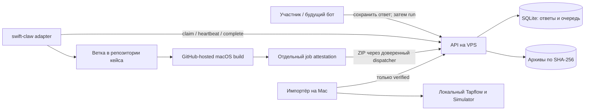

# Инфраструктура активности Crew 18

Основа для механики «кейс дня → идея участника → команда агенту → прототип в ветке → ревью».
Требования взяты из двухстраничного документа «Механика активности Wildberries × swift-claw».
PDF описывает предварительную механику, а не утверждённые задания или правила оценки.
Уточнение организатора: **swift-claw запускается, когда участник сам даёт команду агенту**.

## Что реализовано

- API на FastAPI и SQLite: семь возможных дней, кейсы с закреплённым baseline-коммитом,
  неизменяемые ответы участников, явная команда запуска и отдельные результаты генерации.
- Личные bearer-токены с ролями `participant`, `worker`, `admin`. В базе только SHA-256 токена.
  Участник получает доступ только к своим ответам и результатам. Организатор не запускает
  генерацию от имени участника через `/run`.
- Очередь с атомарным получением задачи, heartbeat и защитой от поздних ответов исполнителя.
  Повторное нажатие во время работы возвращает текущую задачу. Два активных задания на участника.
- Отдельная ветка и bundle ID для каждой попытки. Номер сборки выдаёт сервер.
- Приём ZIP, проверка структуры, встроенного Mach-O и GitHub attestation.
  Неизменяемые архивы хранятся по SHA-256, загрузка для установки разрешена только после проверки.
- CLI переноса проверенной сборки в Tapflow, сборка локального варианта игры и проверка
  сосуществования двух приложений на временном симуляторе.
- Dockerfile, Linux VPS Compose, Caddy и шаблоны зашифрованного rathole-туннеля.
- GitHub Actions: тесты инфраструктуры и отдельный reusable workflow сборки с attestation.

**Это API и контракты инфраструктуры.** Пользовательский кабинет/бот, адаптер swift-claw,
создание Git-веток, отправка workflow_dispatch и автоматический запуск ревью ещё не подключены.
Сохранение ответа и `/run` сейчас создают запись и задачу; без worker код не генерируется.
Никакой режим имитации не выдаёт фиктивный результат за работу агента.

## Разделение компонентов



Кейс хранит `source_repo`, `base_commit`, `project`, `scheme`. Поэтому один репозиторий
на семь дней и семь отдельных репозиториев не требуют разных API. Baseline после создания
не меняется; можно открыть или закрыть приём. Для новой редакции создаётся новый кейс.
Ветка результата: `crew18/<case>/<submission UUID>/<job UUID>`.
Ответ участника никогда не заменяется описанием, написанным агентом.

## Локальный запуск

Нужны Python 3.12+ и uv. Из корня репозитория:

```sh
uv sync --project infra/control-plane --locked
uv run --project infra/control-plane crew-control create-user \
  --id organizer --role admin --token-file var/credentials/organizer.json
uv run --project infra/control-plane crew-control serve
```

По умолчанию API слушает `127.0.0.1:4100`; схема запросов находится в
[Swagger UI](http://localhost:4100/docs), состояние — [/healthz](http://localhost:4100/healthz).
Данные лежат в `var/control`. Токены в `var/credentials` имеют права `600` и исключены из Git.
Это отдельные учётные данные, не пароль администратора Tapflow.
Для сохранения API после выхода из терминала на текущем Mac можно установить LaunchAgent:

```sh
./scripts/install-control-plane.sh
```

Создавайте токен на каждого участника и на каждого экземпляра worker. Не передавайте токен
worker в текст задания агенту, контейнер со сборкой исходников или workflow участника.

```sh
uv run --project infra/control-plane crew-control create-user \
  --id participant-42 --role participant --token-file var/credentials/participant-42.json
uv run --project infra/control-plane crew-control create-user \
  --id worker-1 --role worker --token-file var/credentials/worker-1.json
```

Технический кейс в `infra/examples/case.json` закрыт по умолчанию и явно помечен как пилот.
Его baseline — первый коммит репозитория. Это не задание Wildberries.

```sh
uv run --project infra/control-plane crew-control request \
  --token-file var/credentials/organizer.json --method POST --path /v1/cases \
  --body-file infra/examples/case.json
```

Открыть кейс: `PATCH /v1/cases/pilot` с JSON `{"is_open": true}` от организатора.
Сохранить ответ: `POST /v1/submissions` с JSON из `infra/examples/answer.json` от участника.
Обязателен `Idempotency-Key`, например `answer-2026-001` (в CLI — `--key`).
Отдельная команда участника: `POST /v1/submissions/<id>/run` с другим ключом идемпотентности.
Списки, статусы и доступ к своим результатам доступны через `GET /v1/submissions` и `GET /v1/submissions/<id>`.
Список поддерживает `case_id`, `limit` (до 200) и `offset`.
Повторное использование ключа с другим ответом возвращает `409`.

## Контракт swift-claw worker

1. Доверенный адаптер вызывает `POST /v1/worker/claim`. Получает задачу или `{"job": null}`.
2. Создаёт изолированную рабочую среду из точного `source_repo@base_commit` и указанную ветку.
   `answer` и `prompt` — данные задачи; они не должны становиться shell-командой или настройкой инфраструктуры.
3. Передаёт агенту исходную идею и кейс. Сохраняет исходный ответ без редактирования.
4. Каждую минуту вызывает `/v1/worker/jobs/<id>/heartbeat` с `lease_token` (срок удержания — 5 минут).
5. После фиксации кода в предусмотренной ветке вызывает `/complete` с `outcome`, `summary`, `source_commit`.
   Успех требует полного 40-символьного SHA. Ошибка не удаляет идею и не выставляет оценку участнику.
6. При успехе API возвращает build plan. Доверенный dispatcher запускает сборку на этом коммите,
   скачивает итоговый архив и отправляет ZIP телом `POST /v1/builds/<id>/artifact` с `Content-Type: application/zip`.

После потери связи результат `/complete` можно восстановить через `GET /v1/worker/jobs/<id>`.
При истечении lease задача становится `failed`, поздний результат отклоняется. Автоматического
повторного платного запуска нет: адаптер сначала проверяет ветку и фактический исход,
затем участник может дать новую команду. Worker должен останавливаться, если heartbeat получил `409`.
Одна активная задача на токен worker; несколько токенов дают управляемую параллельность.

## Артефакты и происхождение

Допускается один `.app` в ZIP без `__MACOSX` и посторонних файлов. Лимиты: 128 MiB архив,
512 MiB после распаковки, 20 000 записей, коэффициент сжатия до 200, до 64 MiB на Mach-O.
Пути проверяются с учётом нечувствительной к регистру файловой системы Mac. Ссылки,
специальные файлы, дубликаты и выход через `..` отклоняются. API не распаковывает архив на диск.

Проверяются `CFBundleExecutable`, выданный сервером bundle ID, `MinimumOSVersion`,
`CFBundleSupportedPlatforms` и **arm64 + LC_BUILD_VERSION/IOSSIMULATOR** во всех найденных Mach-O.
Обычная проверка `lipo` недостаточна: arm64 бывает и у iPhone. `inspect` выполняет только
статическую проверку и не разрешает установку через API без attestation.

```sh
uv run --project infra/control-plane crew-control inspect prototype.app.zip \
  --bundle-id SERVER_ISSUED_BUNDLE_ID --runtime 26.5
```

Настройте `CREW_SIGNER_WORKFLOW=wowlocal/crew18-sim/.github/workflows/simulator-build.yml`
и `CREW_SIGNER_DIGEST=<точный коммит проверенного workflow>` на API. Без них приём архивов
завершается `503`. Нужен GitHub CLI с `gh attestation verify` (в образе закреплён 2.100.0).
Для приватных репозиториев может потребоваться `GH_TOKEN` и поддержка attestations тарифом GitHub.

Пример caller workflow — `infra/examples/case-workflow.yml.example`. Он устанавливается в
репозиторий кейса и вызывает наш reusable workflow по SHA. Dispatcher обязан запустить его
на **том же source commit**, который записан в build plan. Сборочный job не имеет права подписи;
отдельный job подписи не делает checkout и не выполняет код участника.
Проверяются repo, source SHA, путь signer workflow, его SHA и GitHub-hosted runner.
Нельзя подставлять произвольный `--owner` или снимать проверки, чтобы принять локальный ZIP.

`verified` означает статическую проверку и происхождение; это не доказательство безопасности
кода и не успешное игровое ревью. Проверка запуска приложения на отдельном устройстве выполняется
после импорта. Автоматический smoke-test worker и его отдельный статус — следующий этап.

## Разные версии одной работы

Build plan выдаёт `io.podlodka.crew18.s<submission UUID>.b<build UUID>`.
Идентификатор задаётся в Xcode **до** упаковки и attestation. Все версии остаются связаны
с одним ответом в API, хотя Tapflow группирует разные bundle ID как разные приложения.
Для текущего простого SwiftUI-проекта локальный путь выглядит так:

```sh
CREW_BUNDLE_ID=SERVER_ISSUED_BUNDLE_ID ./scripts/build-submission.sh
```

Скрипт предназначен для одного app target. Для проектов с extensions, App Groups, Keychain
и URL schemes потребуется отдельная политика согласования идентификаторов; глобальное
переопределение `PRODUCT_BUNDLE_IDENTIFIER` нельзя автоматически распространять на такие кейсы.
На одном симуляторе у вариантов разные контейнеры данных. Параллельное управление требует
нескольких симуляторов, а не только разных bundle ID.

## Импорт в Tapflow

На Mac создайте отдельный PAT Tapflow с `builds:write`, храните в локальном файле с правами `600`.
Импортёр получает только `verified`-архив, повторно проверяет SHA-256 и структуру, затем загружает его
в Tapflow. Он не запускает приложение и не перепаковывает файл.

```sh
uv run --project infra/control-plane crew-control promote \
  --api https://API_DOMAIN --build-id BUILD_ID \
  --token-file var/credentials/worker-1.json \
  --tapflow http://127.0.0.1:4000 --tapflow-token-file var/credentials/tapflow-pat
```

Повторный `promote` сейчас создаёт ещё одну запись в Tapflow: автоматический импорт требует
журнала доставки/идемпотентности в будущей интеграции. Прямой локальный Upload build остаётся
административным обходом gate; публичный Caddy запрещает этот endpoint для браузера.

## Развёртывание и эксплуатация

См. [инструкцию VPS](../infra/deploy/README.md). Внешняя сеть сейчас не активирована.
На первом этапе один экземпляр API/SQLite. База и архивы сохраняются на отдельном volume.

```sh
uv run --project infra/control-plane crew-control backup --output /PRIVATE_BACKUP_PATH/crew.tar.gz
uv run --project infra/control-plane crew-control revoke-user --id participant-42
```

Backup делает согласованный SQLite snapshot и копирует только referenced verified-архивы.
Он включает хеши токенов, но не исходные bearer-токены из `var/credentials`; их храните отдельно.
Восстановление: остановить API, распаковать доверенный backup в пустой data directory,
назначить владельца процесса и права `700` каталогу / `600` базе, затем запустить API.
После аварии во время загрузки, при остановленном API: `crew-control recover-uploads`.

## Проверка

```sh
uv run --project infra/control-plane --locked pytest -q
bash -n scripts/build-submission.sh scripts/install-control-plane.sh
python3 scripts/check-simulator-variants.py FIRST.app SECOND.app \
  --runtime com.apple.CoreSimulator.SimRuntime.iOS-26-5
```

Последняя команда создаёт отдельный временный симулятор, устанавливает две доверенные локальные
сборки, проверяет запуск и разные data containers, затем удаляет только созданное устройство.
Тестовые аттестации подменяются исключительно внутри unit-тестов; production API такого режима не имеет.

Перед приёмом работ сезона остаётся подключить swift-claw и GitHub dispatcher, пользовательский
интерфейс/бот, реальные кейсы и список участников, бюджет генераций, отдельное окружение выполнения
на Mac и внешний домен. Качество сгенерированного кода не превращается автоматически в оценку идеи.
